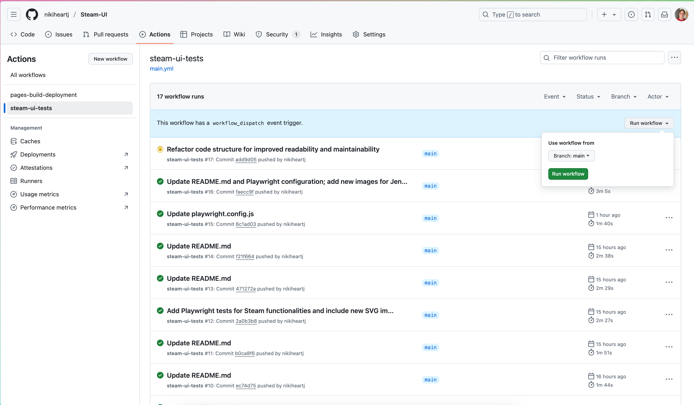
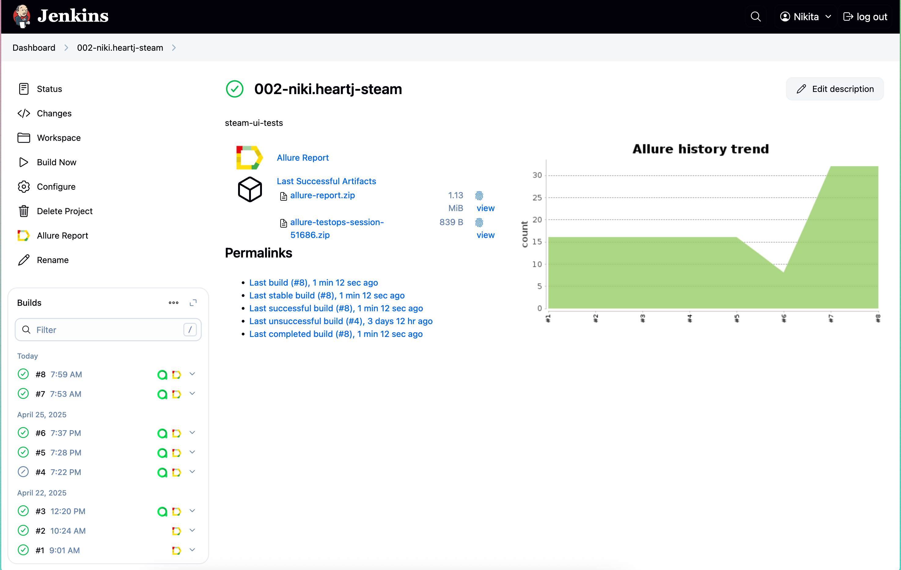
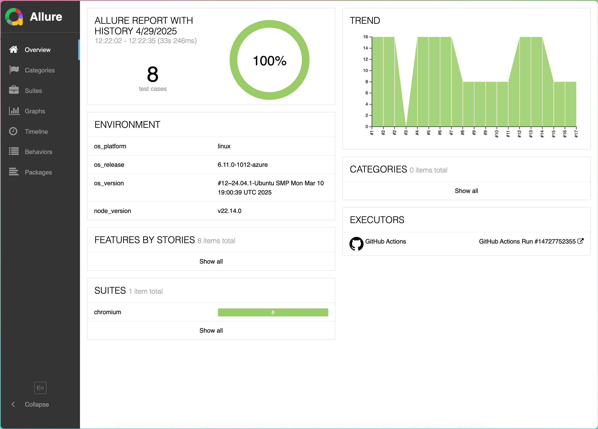
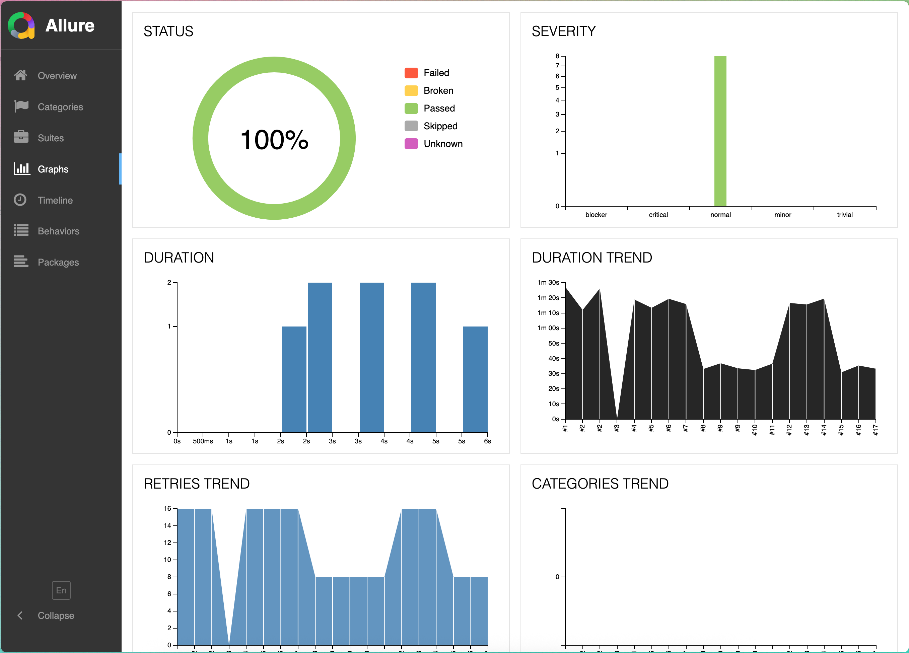
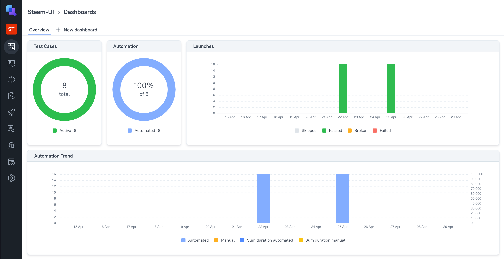
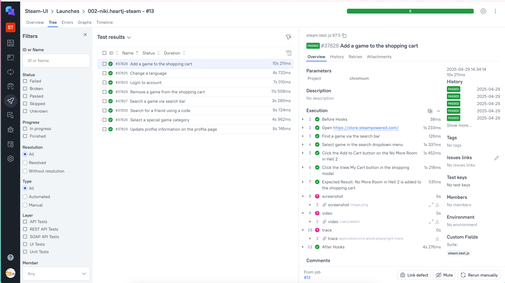
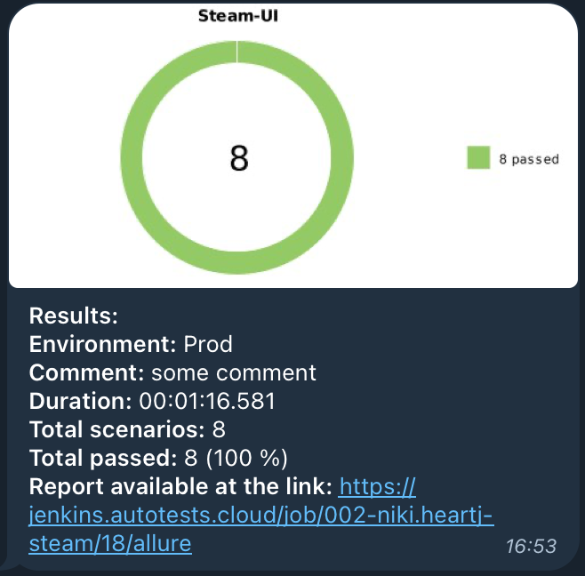

<h1 >Automation UI project for <a href="https://store.steampowered.com/ ">Steam</a></h1>


## :bookmark_tabs: Сontent

- <a href="#tools">Technology Stack</a>

- <a href="#cases">Automated Checks</a>

- <a href="#console">Run tests from the command line</a>

- <a href="#github">Running tests in GitHub Actions</a>

- <a href="#jenkins">Running tests in Jenkins</a>

- <a href="#allure">Test reports in Allure Report</a>

- <a href="#allure-testops">Integration with Allure TestOps</a>

- <a href="#telegram">Notifications in Telegram using a bot</a>

- <a href="#video">Example of a test run in Playwright</a>

<a id="tools"></a>

## Technology Stack

| JavaScript                                                                                                    | VS Code                                                                                                                             | GitHub                                                                                                    | Playwright                                                                                                         | Allure                                                                                                          | Allure TestOps                                                                                                | Telegram                                                                                                        |                                                                                                         Jenkins |
| :------------------------------------------------------------------------------------------------------------ | ----------------------------------------------------------------------------------------------------------------------------------- | --------------------------------------------------------------------------------------------------------- | ------------------------------------------------------------------------------------------------------------------ | --------------------------------------------------------------------------------------------------------------- | ------------------------------------------------------------------------------------------------------------- | --------------------------------------------------------------------------------------------------------------- | --------------------------------------------------------------------------------------------------------------: |
| <a href="https://nodejs.org/en"></a> | <a id ="tech" href="https://code.visualstudio.com/"></a> | <a href="https://github.com/"></a> | <a href="https://playwright.dev/"></a> | <a href="https://allurereport.org/"></a> | <a href="https://qatools.ru/"></a> | <a href="https://telegram.org/"></a> | <a href="https://www.jenkins.io/"></a> |

<a id="cases"></a>

## :ballot_box_with_check: Automated Checks

- :small_blue_diamond: Login to account
- :small_blue_diamond: Update profile information on the profile page
- :small_blue_diamond: Change a language
- :small_blue_diamond: Select a special game category
- :small_blue_diamond: Search a game via search bar
- :small_blue_diamond: Add a game to the shopping cart
- :small_blue_diamond: Remove a game from the shopping cart
- :small_blue_diamond: Search for a friend using a code

<a id="console"></a>

## :computer: Run tests from the command line

### Running tests locally

```
npm t
```

### Create & open allure-report locally

```
npm run create-report
npm run open-report
```

<a id="github"></a>

## </a> Running tests in GitHub Actions

<p align="center">

<a href="https://jenkins.autotests.cloud/job/AD_demo_ui_steam/"></a>

> The workflow is configured for manual triggering via GitHub Actions.

</p>

<a id="jenkins"></a>

## </a> Running tests in Jenkins

<a target="_blank" href="https://jenkins.autotests.cloud/job/002-niki.heartj-steam/
/">Build in Jenkins</a>

<p align="center">

<a href="https://jenkins.autotests.cloud/job/AD_demo_ui_steam/"></a>

> To start running the tests, you need to log in to the Jenkins website, navigate to the required job, and click "Build Now." After the pipeline completes, an Allure report will be generated, and the test results will be sent to Allure TestOps and Telegram.

</p>

<a id="allure"></a>

## </a> Test reports in [Allure Report](https://nikiheartj.github.io/Steam-UI/17/index.html#graph)

### Main window

<p align="center">

</p>

### Graphs window

<p align="center">

</p>

### Tests

> Each check is accompanied by a screenshot of the last action in the test and logs..

<p align="center">

</p>

<a id="allure-testops"></a>

## </a> Integration with [Allure TestOps](https://allure.autotests.cloud/project/2296/dashboards)

> Test runs can be visualized as charts.

<p align="center">

</p>

> Test cases stay up-to-date since scenarios are extracted from the code.

<p align="center">

</p>

<a id="telegram"></a>

## </a> Notifications in Telegram using a bot

<p >

</p>

<a id="video"></a>

## </a> Playwright Test Run Example

> Test run recording: "Add a game to the shopping cart".

<p align="center">
  
</p>
